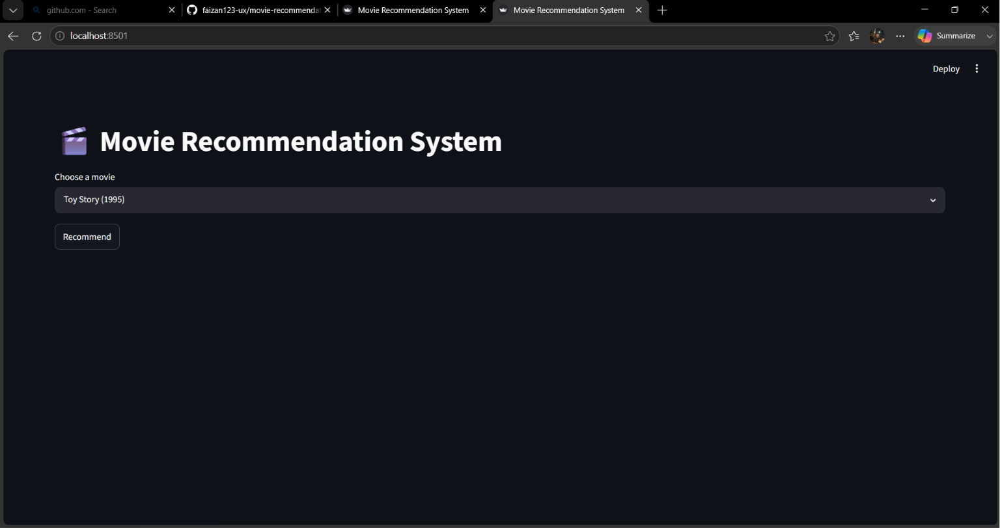
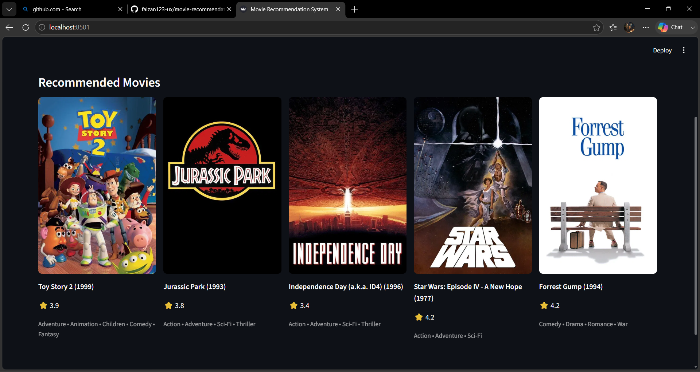

🎬 Movie Recommendation System

A Movie Recommendation System built with Python and Streamlit that helps users discover movies based on their preferences. The system analyzes movie data and provides personalized recommendations using recommendation algorithms.

🚀 Features

- Movie recommendation engine
- Interactive Streamlit web interface
- Search for movies easily
- Personalized movie suggestions
- Uses movie and ratings datasets
- Fast and user-friendly interface

🛠️ Technologies Used

- Python
- Streamlit
- Pandas
- NumPy
- Scikit-learn
- MovieLens Dataset

📂 Project Structure

movie-recommendation-streamline/
│
├── app.py
├── recommender.py
├── movies.csv
├── ratings.csv
├── requirements.txt
├── README.md
└── .gitignore

⚙️ Installation

1. Clone the repository

git clone https://github.com/faizan123-ux/movie-recommendation-streamline.git

2. Move into the project folder

cd movie-recommendation-streamline

3. Install dependencies

pip install -r requirements.txt

4. Run the application

streamlit run app.py

📸 Screenshots

Home Page

Add a screenshot here:

Recommendation Results

Add a screenshot here:

📊 Dataset

The project uses:

- movies.csv
- ratings.csv

These datasets contain movie information and user ratings used to generate recommendations.

🎯 Future Improvements

- Content-based recommendations
- Hybrid recommendation system
- User authentication
- Movie posters and trailers
- Better recommendation accuracy
- Cloud deployment

👨‍💻 Author

Faizan

GitHub: https://github.com/faizan123-ux
